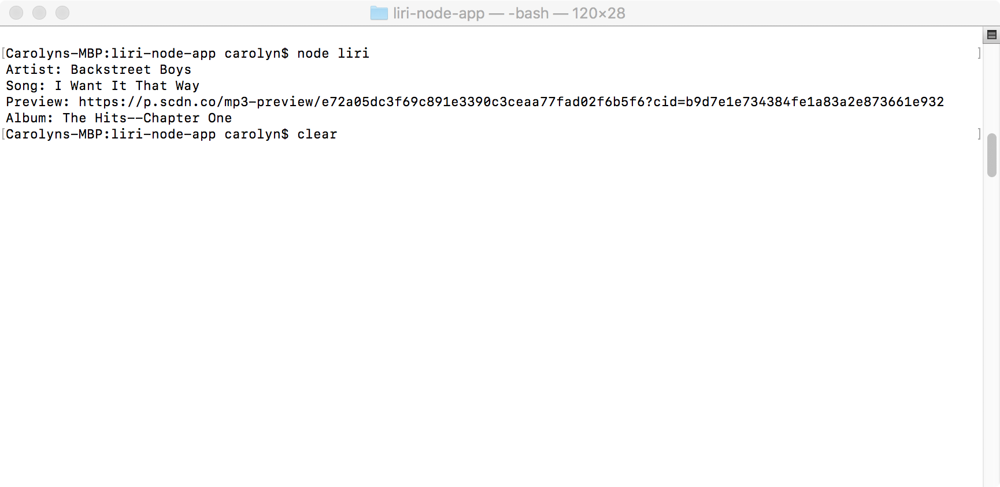
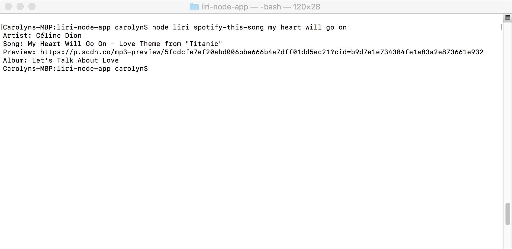
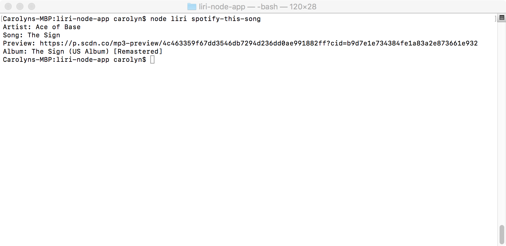
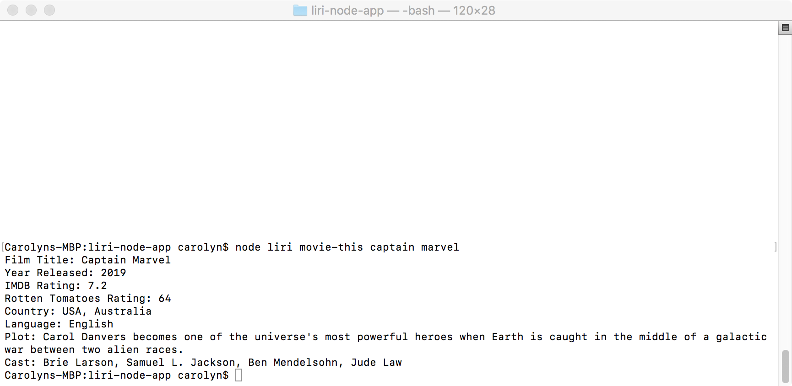
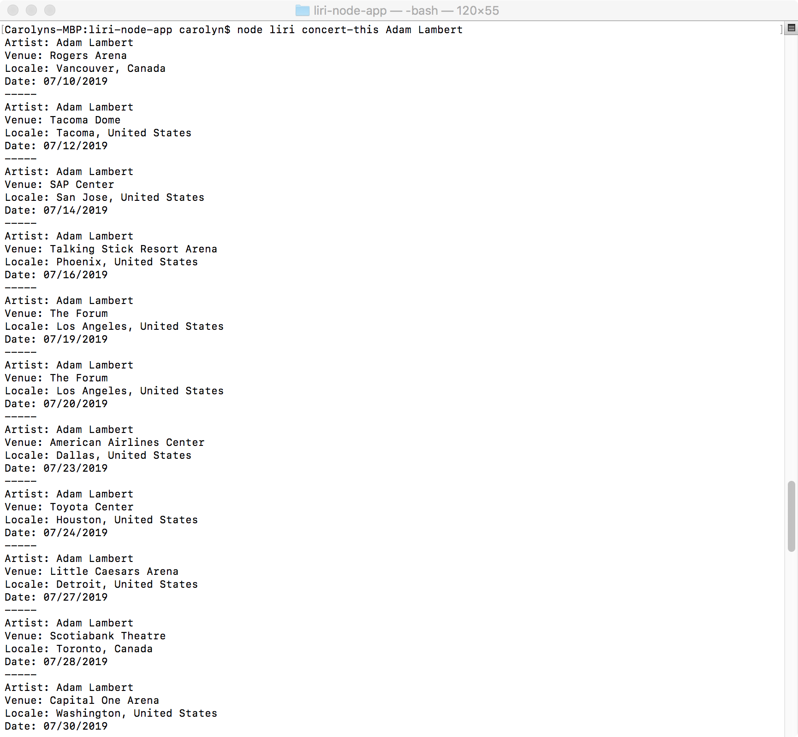
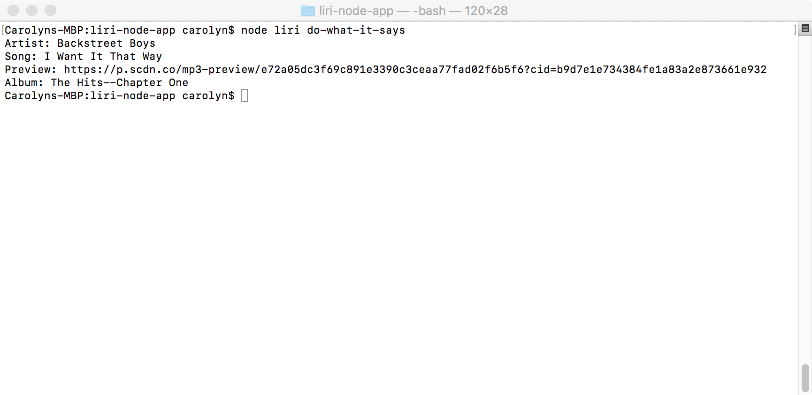

# liri-node-app
LIRI is a Command Line Interface (CLI) app that will search Spotify for songs, Bands in Town for concerts, and OMDB for movies. 

## Default Search
Running the app with no parameters triggers the default search:

## Spotify Search
The user can search for song information via Spotify:

A Spotify search with no search parameters renders the default search:

## Movie Search
The movie-this command queries OMDB for basic movie information:

## Concert Search
LIRI can also provide upcoming concert information via the Bands In Town API:

## Do What It Says
The do-what-it-says command reads a "random.txt" file to pull the query type and parameters.  This is also the default query when no (or a mis-typed) command is entered (see Default Search).

## Log
The app also logs all commands and results to a log.txt file, so the user can revisit any results that they might want to read later!